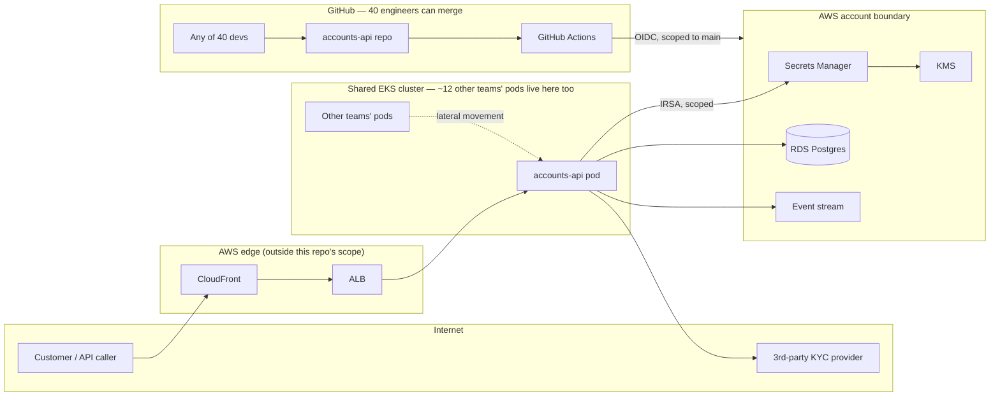

# Threat Model — `accounts-api`

## Trust boundaries

Five boundaries matter: (1) public internet -> edge, (2) edge -> shared cluster, (3) inside the cluster, accounts-api's pod vs. everyone else's, (4) pod -> AWS account (IAM), (5) any of 40 engineers -> the pipeline that reaches production.

## Top 5 threats, ranked by how likely they are to actually happen here

| # | Threat | Entry point | What's reached | Control in this submission / risk accepted |
|---|---|---|---|---|
| 1 | A bad or malicious merge (of 40 possible mergers, no security team) ships a vulnerable or tampered image | PR merge to `main` | Production pod with a live path to customer PII in RDS | **Built.** Trivy + Gitleaks + Checkov block the merge; Cosign signs the image; Kyverno `verifyImages` refuses any pod whose image isn't signed by this exact CI identity — so even a merge that slips past review can't reach a running pod unsigned. |
| 2 | A secret (DB creds, KYC key) gets committed to git by one of 40 engineers | `git push` | Full repo history — readable by everyone with repo access, and by anyone if the repo or a fork ever leaks further | **Built.** Gitleaks blocks the push/PR. Also structural: no secret ever lives in a manifest, image, or env var — the pod fetches from Secrets Manager at runtime via IRSA, so there's nothing in the repo to leak in the first place. |
| 3 | A compromised or careless workload from one of the ~12 other teams on the same cluster pivots into accounts-api's pod or its DB path | Neighbor team's pod, same cluster | accounts-api's network path to RDS, or the pod itself | **Built.** Default-deny NetworkPolicy (only the ingress controller and DNS/RDS/KYC egress are allowed) + PSA `restricted` + Kyverno pod hardening (no root, no privileged, no hostPath) — limits both what a neighbor can reach and what a compromised accounts-api pod itself could do to the node or to other tenants. |
| 4 | After a container compromise (via #1 or #3), an over-permissioned IAM role is used to reach further into the AWS org | Compromised pod runtime | Other secrets, other accounts in the org, if the role is broad | **Built.** IRSA role scoped to exactly this service's own secret ARNs and KMS key — no wildcard resource anywhere. Caps the blast radius of #1/#3 even if they succeed. |
| 5 | IaC misconfiguration (public RDS, open security group, unencrypted storage) shipped by a 2-person platform team with no dedicated reviewer | `terraform` merge | Direct data exposure, bypassing every application-layer control above | **Built.** Checkov blocks the CI job on `terraform plan`; KMS encryption is enforced at the key-policy level, not left to a checkbox on the RDS resource. |

## What I'm not spending budget on, and why
**Overrated in this context: a sophisticated external network attack directly against CloudFront/ALB** (DDoS, L7 exploits, TLS downgrade). This is where most take-home submissions over-invest — WAF rule tuning, rate limiting, edge hardening — but it's already the most externally-hardened, most mature layer in a real AWS setup (managed services, Shield, standard WAF managed rule groups), and it isn't this system's actual weak point. Given 40 mergers with no security team and a cluster shared with a dozen other tenants, the realistic breach path is internal — a bad merge, a leaked secret, a noisy neighbor — not a novel exploit against CloudFront. That's why the edge is named as an assumption and left alone, and the five threats above got the time instead.

## Controls built beyond the top 5 (traceability for the rest of the submission)
- **Egress scoping to the KYC provider specifically** (not just "default-deny") — not one of the top 5 on its own, but it's the cheapest possible narrowing of #3/#4's blast radius once a pod is compromised, so it rides along with the NetworkPolicy already built for #3.
- **Falco runtime rule (shell exec, unexpected egress)** — doesn't map to a top-5 entry point; it's deliberately last-line-of-defense for the case where #1-#5 all fail anyway. One rule, not a ruleset, because a 2-person platform team can't tune more than that without alert fatigue.
- **SBOM generation (Syft)** — not a control against a specific threat, it's an audit artifact a bank's examiner would ask for regardless of which of the five threats materialised.

Full reasoning for every enforce/accept decision, including the ones deliberately left un-enforced, is in `docs/DECISIONS.md`.
